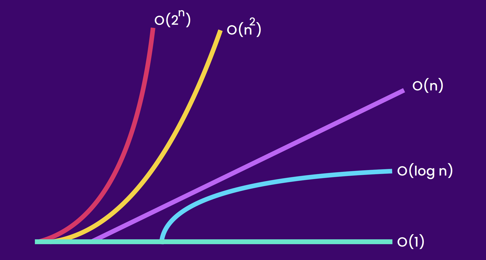
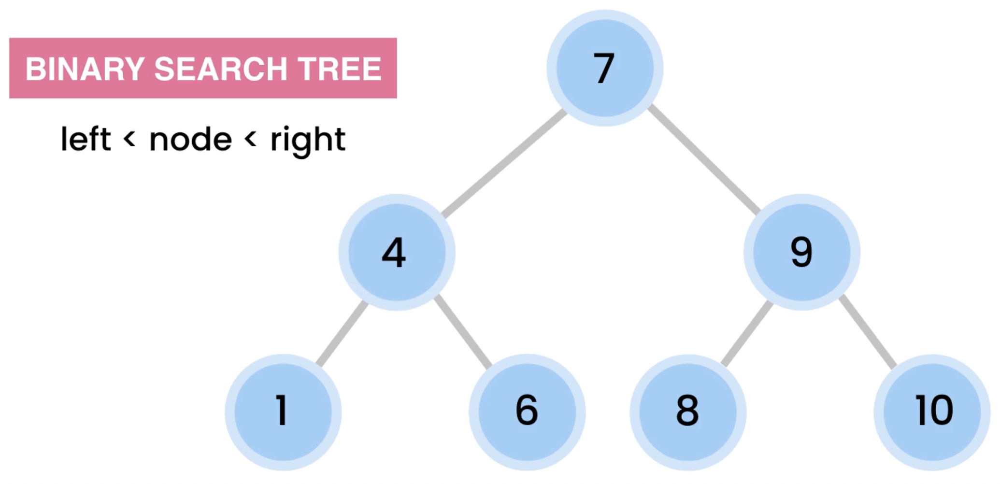
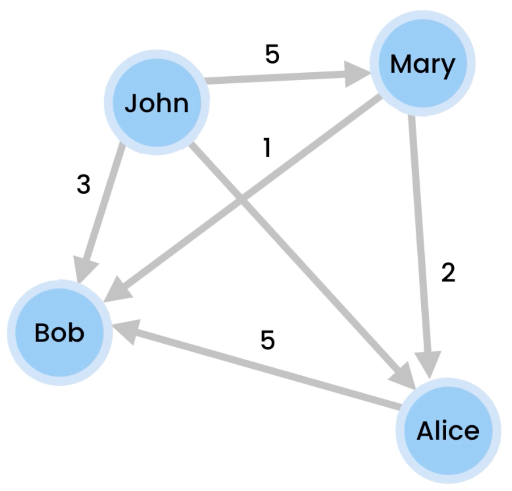
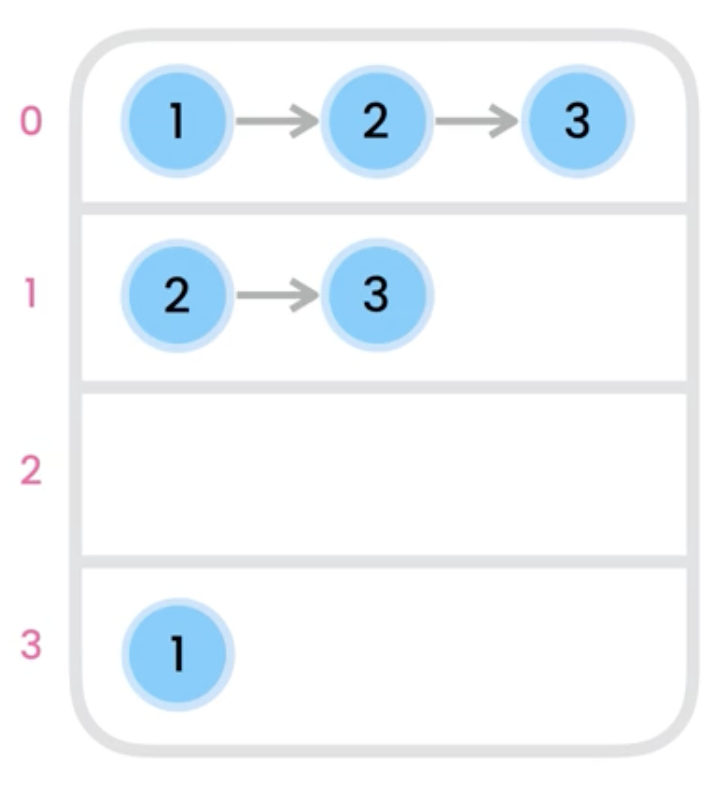

# Data Structures and algorithms

## The Big O Notation

The big O Notation is used to describe the efficiency of a function and his scalability. It can be used to describe **Time** or **Space** complexity.

### O(1) | Constant

```
public void log(int[] numbers){
    System.out.println(numbers[0]);
}
```

No matter how much object there is, it will always do 1 operation.

### O(n) | Linear

```
public void log(int[] numbers){
    for (int i = 0; i < numbers.length; i++) {
        System.out.println(numbers[i]);
    }
}
```

The time taken for the function grows linearly with the size of the input.

### O(n^2) | Quadratic

```
public void log(int[] numbers){
    for (int first: numbers)
        for (int second: numbers)
            System.out.println(first + ", " + second);
}
```

The time taken for the function grows quadratically with the size of the input.

### O(log n) | Logarithmic


The functions has a logarithmic growth, which is the inverse of exponential growth. It gets smaller than the size of the input over time.

### O(2^n) | Exponential

The execution time of the function grows exponentially with the size of the input.

### Summary



# Data Structures

## Array


The simplest data structure.
Arrays Consist of linear blocks of memory accessible using an index for each block. It can be static dynamic depending on the implementation. It is very fast at accessing data using the index.

### Runtime Complexities

- Lookup by index : O(1)
- Lookup by value : O(n)
- Insert : O(n)
- Delete : O(n)

## Linked list


Data structure that consist of a head and a tail, with each node referencing the next node. It is the base of other types of data structures, like stacks and queues.

### Runtime Complexities

- Lookup by Index : O(n)
- Lookup by value : O(n)
- Insert at the beginning : O(1)
- Insert at the end : O(1)
- Insert in the middle : O(n)
- Delete from the beginning : O(1)
- Delete from the end : O(n)
- Delete from the middle : O(n)

### Comparison with Arrays

- Static arrays have a fixed size
- Dynamic arrays grow by 50%-100%
- Linked lists is space efficient
- Use arrays if you know the number of items to store
- Arrays lookup by index is always faster

### Types of linked list

#### **Single**


#### **Doubly**


Doubly linked list solves the problem of slow deletion from the end at the cost of more memory usage.

#### **Circular**


The last node refers to the first node.

## Stacks


**Last in First Out behavior** (LIFO)

Stacks is used to solve many problems of modern day application. For example, it is used for the "undo" feature in many text based application. It is build into compiler for syntax checking and it is used for the "navigation" feature insides many mobiles applications.
It uses an array or a linked-list as the main data structure, but the constraints on the operations makes it faster.

### Stack operations

| Name       | Behavior                     | Time |
| :--------- | :--------------------------- | :--- |
| push(item) | add an item at the top       | O(1) |
| pop        | remove the item from the top | O(1) |
| peek       | lookup the item on the top   | O(1) |
| empty      | lookup if the stack is empty | O(1) |

### Problems where the stack is useful

- Reversing a stream of data
- When you need to go backward
- Balancing a string

## Queues


**First in First Out behavior** ( FIFO)

### Queue operations

| Name          | Behavior                     | Time |
| :------------ | :--------------------------- | :--- |
| enqueue(item) | add an item at the end       | O(1) |
| dequeue()     | remove the first item        | O(1) |
| peek()        | lookup the first item        | O(1) |
| isEmpty()     | lookup if the queue is empty | O(1) |
| isFull()      | lookup if the queue is full  | O(1) |

### Problems where the queue is useful

- Managing turn based operation
- Printer management
- Operating system operation
- Server request
- Live support systems

## Hash Tables (Dictionnaries)

Hash tables are super fast for lookup. At a high level, Hash maps uses a key and value pair to lookup the differents values inside the structure. It uses a hash function _(deterministic function)_ to determine the address using the unique identifier.

### Hash and Set Differences

Set contains only a key, which is useful for list without duplicate.

### Hash Tables operations

| Name               | Behavior                                                      | Time |
| :----------------- | :------------------------------------------------------------ | :--- |
| insert(key, value) | add a value to the table at the specified key                 | O(1) |
| delete(key)        | remove the value where the specified key address in the table | O(1) |
| lookup(key)        | lookup an item in the table                                   | O(1) |

### Hash function

A hash function is used to transform the unique key into a unique address in memory. For example, a Hash function of a 100 employees could transform the unique identifier of each employee into an index in between 0 and 99 .

### Collision

A collision is when two key collides into one index. This problem can be solve by using a Linked List at each index. This approach is called chaining. The other way is to find another address to store the value. This approach is called open addressing.

### Chaining diagram


### Open Addressing diagram


#### Open addressing problems with linear probing

Linear probing is when the address chosen during a collision is determined with a number increment. When a large amount of value are placed together, they form a cluster. The cluser can significantly slow down the data structure, because the linear probing has to go through the whole cluster before finding a slot.

**Linear equation**

```
hash(key) + i
```

**Quadratic equation**

```
hash(key) + i^2
```

#### Addressing the problem with quadratic probing

Quadratic probing solves the problem by incrementing by ^2. However, quadratic probing leads to another problem : infinite loop.

#### Addressing the problem with double hashing

Using a second hash algorithm that takes into a account prime number makes the most efficient equation to quickly find empty slot.


### Problems where the hash map is useful

- When you need fast access to alot of data
- Databases

### Summary

#### Hash tables are used

- To store key/value pairs
- insert, remove, lookup in O(1)
- Uses a hash function to find the index
- Hash function can create collision, where 2 key collide into one address.
- This problem can be solve using chaining or open addressing

#### Probing algorithm


## Binary Trees


Binary Trees are a non-linear data structure where every node can only have two children, forming subtrees. A correctly balanced binary trees has a runtime complexity of O(log n).

### Binary Search Tree

The right node is always greater than the left node

```
left < node < right
```



### Trees Operations

| Name               | Behavior                                 | Time     |
| :----------------- | :--------------------------------------- | :------- |
| insert(key, value) | add a value to the tree key              | O(log n) |
| delete(key)        | remove the value from the specified node | O(log n) |
| lookup(key)        | lookup an item in the tree               | O(log n) |

### Traversing Trees

#### Breadth first (level order)


Uses level order.

#### Depth first

- Pre-order : Root then Left then Right


- In-order : Left then Root then Right


Items are in ascending order

- Post-order : Left then Right then Root


### Depth and Height of Nodes

Depth is the number of edges we have to transferse to reach the target node.

Height is the opposite of depth, you calculate the number of edges from the farthest leaf to the target node. Leaves have a height of 0.


### Trees Applications

- Represent hierachical data
- Databases
- Autocompletion
- Compilers
- Compression (JPEG, MP3)

### Summary

In a binary tree, a node can have up to 2 children.
A node without children is called a leaf. the height of a leaf is 0. the height of the tree equals the height of the root node, which is the longest path to a leaf. the depth of the root is 0. the depth of a node is the number of edges between it and the root. A Binary Search Tree is a tree where all the left child are smaller than his parent and all the right child are greater that his parent.

## AVL Trees (Self-Balancing Trees)

A self balancing tree is a tree that automatically keeps the difference of height between the left and right subtree to a maximum of 1. This is important to keep the runtime efficiency of O(log n).

### Rotations

A rotation is a transformation used to balance the tree.

#### Types of rotation

- Left (LL)
  
  1 is too heavy (the difference of height between left (0) and right (2) is bigger than 1), and needs to go down.
  
  1 goes down and 2 goes up. The tree is now balanced.
- Right (RR)
  
  3 is too heavy (the difference of height between left (2) and right (0) is bigger than 1), and needs to go down.
  
  3 goes down and 2 goes up, The tree is now balanced.
- Left-Right (LR)
  
  When the inbalance is in the left child right subtree (see arrow for reference), you have to perform a left rotation, followed by a right rotation.
  
  After a left rotation on the left child (5), the 5 goes down and the 7 goes up. When now have a left skewed tree
  
  After the right rotation, the tree is now balanced.

- Right-Left (RL)
  
  When the inbalance is in the right child left subtree (see arrow for reference), you have to perform a right rotation, followed by a left rotation.
  
  After the right rotation on the right child (10), the 10 goes down and the 7 goes up. We now have a right skewed tree
  
  After the left rotation, the tree is now balanced.

### Other types of Self-Balancing Trees

- Red-black Trees
- B-trees
- Splay Trees
- 2-3 Trees

## Heaps


A Heap is a complete tree where the value of every node is greater than or equal (max heap) or smaller than or equal (min heap) to his children. The removed value is always the element at the top of the heap (the root node).

### Bubbling up

to keep the integrity of the heap, inserted values can Bubble up to the required height so that the property of the heap is not violated.

### Bubbling down

to keep the integrity of the heap, when an item is deleted, the last node in the heap takes the place of the deleted node and then bubbles down to his respective place.

### Calculating the index

Because Heaps are complete binary trees, it is easier to use an array in memory, as it never leaves a gap between each memory address.


#### Calculating the left child index

```
parent * 2 + 1
```

#### Calculating the right child index

```
parent * 2 + 2
```

### Calculating the parent index

```
(index - 1) / 2
```

### Heaps Operations

| Name               | Behavior                                             | Time     |
| :----------------- | :--------------------------------------------------- | :------- |
| insert(key, value) | add a value to the heap key                          | O(log n) |
| delete(key)        | remove the value from the specified node in the heap | O(log n) |
| getMax()           | lookup the biggest item in the heap                  | O(1)     |

### Heaps Applications

- Sorting (HeapSort)
- Graph algorithms (shortest path)
- Priority Queues
- Finding the Kth smallest/largest value

### Summary

Heap is a complete binary tree filled with node from left to right. We have two type of heaps : min heap and max heap. All the children in a max heap is smaller than the parent. In contrast, all the children in a min heap is greater than the parent.

## Tries (prefix tree)


Tries (also known as radix trees or prefix trees are tree-based non-linear data structures used to store associative arrays. Contrary to most tree, tries are not binary, which means they can have more than two children per node.

### Tries Operations

| Name          | Behavior                                              | Time                                    |
| :------------ | :---------------------------------------------------- | :-------------------------------------- |
| insert(value) | add a value to the trie                               | O(L ) where L is the length of the word |
| delete(key)   | remove the value from the specified value in the trie | O(L) where L is the length of the word  |
| Lookup()      | Lookup a value                                        | O(L) where L is the length of the word  |

### Tries Applications

- Autocompletion

## Graphs



Graphs are a non-linear data structure that represent relationship between set of vertices (also called nodes or points). They can be weighted and directed.

### Graph implementing an adjacency Matrix


A graph can be programmed using an adjacency matrix. By using an adjacency matrix to define relation, the implementation becomes very straightforward and simple. However, it's not space efficient, because for every element you need to instanciate a line and a column in the matrix. (space complexity of O(n^2))

#### Graph Operations using an Adjacency Matrix

**Space** O(v^2)

| Name            | Behavior                       | Time                                           |
| :-------------- | :----------------------------- | :--------------------------------------------- |
| insert(node)    | add a node to the graph        | O(v^2 ) where v is the number of vertex (node) |
| delete(node)    | delete a node to the graph     | O(v^2 )                                        |
| addEdge()       | add an edge between 2 nodes    | O(1)                                           |
| removeEdge()    | remove an edge between 2 ndoes | O(1)                                           |
| findNeighbors() | finds the neighbors of a node  | O(v)                                           |

### Graph implementing an Adjacency List



Using an adjacency list (an array of linked list), you solve the space complexity problem of the matrix.

#### Graph operations using an Adjacency List

**Space** O(v + e) where v is the number of vertex and e the number of edges.

| Name            | Behavior                       | Time                              |
| :-------------- | :----------------------------- | :-------------------------------- |
| insert(node)    | add a node to the graph        | O(1)                              |
| delete(node)    | delete a node to the graph     | O(v^2)                            |
| addEdge()       | add an edge between 2 nodes    | O(k)here k is the number of edges |
| removeEdge()    | remove an edge between 2 ndoes | O(k)                              |
| findNeighbors() | finds the neighbors of a node  | O(k)                              |

### Choosing between a list and a matrix

- When the graph is very dense (lots of edges) : Matrix
- When Adding and removing edge is important, but not adding and removing nodes : Matrix
- When space is important : List
- When node are constantly added : List

### Traversal Algorithms

- Depth First

  Goes as far as possible before looking at the neighbors.

- Breadth-First
  Looks for every neighbors before moving to the other nodes.

When using an iterative method, the only difference between a depth and a breadth is that a depth uses a stack to contain the items (LIFO) while the breadth uses a queue (FIFO).

### Dijkstra's Shortest past Algorithm


Dijkstra finds to shortest path by traversing the graph and choosing the fastest route at every iteration, while keeping track of the distance achieved to reach each nodes. By keeping track of the shortest distance to reach a node, Dijkstra's algorithm can remember the shortest path once the target node is acquired. Dijkstra is considered a "greedy" algorithm, because it chooses the smallest route at every iteration.

### Minimum spanning tree

A minimum spanning tree is a graph with no cycle, which means the number of edge is equal to the number of node - 1.

### Prim's algorithm


To create a minimum spanning tree, you can use prim's algorithm.

### Graphs Applications

- Model relationship
- Social Network
- GPS
- Maps
- Labyrinth
- Network

# Sorting algorithms

## Bubble Sort


Finds and elevates (or bubbles up) the highest value until it reaches the end of the array by comparing itself to each element.

### Time Complexity

|             |   Best   |   Worst    |
| ----------: | :------: | :--------: |
|      Passes |   O(1)   |    O(n)    |
| Comparisons |   O(n)   |    O(n)    |
|   **Total** | **O(n)** | **O(n^2)** |
|             |  Linear  | Quadratic  |

## Selection sort


Finds the smallest element in the array and put it in the first index. Repeat until sorted.

### Time Complexity

|             |    Best    |   Worst    |
| ----------: | :--------: | :--------: |
|      Passes |    O(n)    |    O(n)    |
| Comparisons |    O(n)    |    O(n)    |
|   **Total** | **O(n^2)** | **O(n^2)** |
|             | Quadratic  | Quadratic  |

## Insertion sort


For each element, we compare it to the one on the left, and we shift the one on the left if it's smaller, comparing each element on the left until we find the correct place.

### Time complexity

|             |   Best   |   Worst    |
| ----------: | :------: | :--------: |
|   Iteration |   O(n)   |    O(n)    |
| Shift items |   O(1)   |    O(n)    |
|   **Total** | **O(n)** | **O(n^2)** |
|             |  Linear  | Quadratic  |

## Merge sort


Merge sort divides the main array in half into two smaller arrays. we repeat the process with the smaller arrays until we can't divide each array. From this point on we bring back the arrays one by one. This sort is efficient because you know that the first item in a subarray is the smallest item, and that every other item in the subarray is bigger then this item, thus narrowing your search.

### Time complexity

|           |      Best      |     Worst      |
| --------: | :------------: | :------------: |
|  Dividing |    O(log n)    |    O(log n)    |
|    Mergin |      O(n)      |      O(n)      |
| **Total** | **O(n log n)** | **O(n log n)** |
| **Space** |    **O(n)**    |    **O(n)**    |

## Quick sort


The quick sort uses a pivot to compare items together. every item greater than the pivot goes to the right, and every item smaller to the left. Once every item is compared, the pivot is at his definitive position. What makes the quick sort efficient is that once the pivot has been placed, you don't have to worry about the item on the other side of the pivot when you choose another pivot, because you know that every item on the other side is greater or smaller than the pivot, thus narrowing your search.
